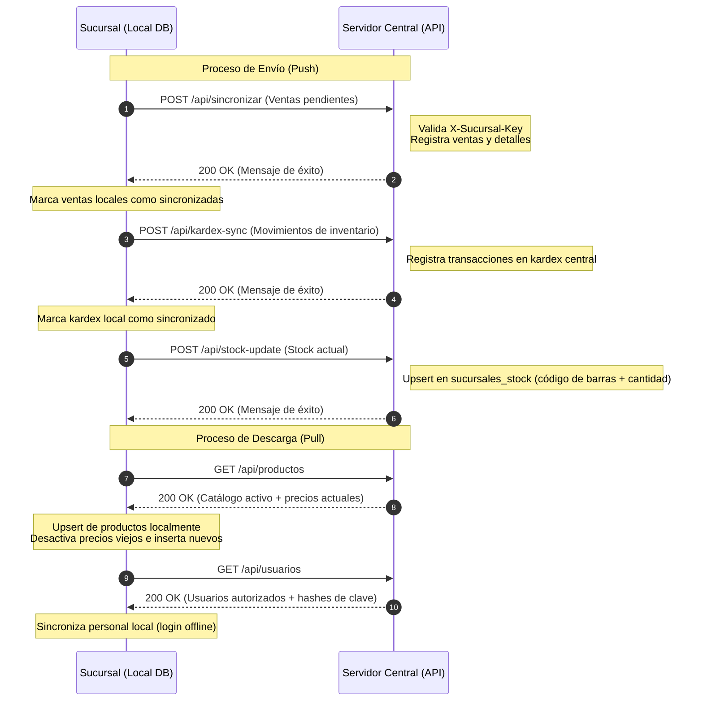

# Análisis del Modelo de Sincronización de Datos

Este documento describe la arquitectura y el flujo de datos del proceso de sincronización entre el **Sistema Local de la Sucursal** (aplicación de escritorio/Tauri) y el **Servidor Central** (API backend en Rust/Axum).

---

## 🔄 Diagrama del Flujo de Sincronización

El siguiente diagrama ilustra cómo fluyen los datos y qué endpoints se consumen durante el proceso de sincronización:

---

## 📤 1. Datos Enviados al Equipo Central (Push)

Las sucursales son responsables de reportar sus transacciones comerciales, movimientos de stock e inventario actual. Esto garantiza la consolidación de reportes a nivel central.

| Entidad / Datos | Método y Endpoint | Estructura de Datos (Campos) | Comportamiento Local Posterior |
| :--- | :--- | :--- | :--- |
| **Ventas Realizadas** | `POST /api/sincronizar` | - `fecha` (ISO Date) - `total` (decimal) - `usuario_id` (creador) - `metodo_pago` (EFECTIVO, etc.) - **Detalles:** `codigo_barras`, `cantidad`, `precio_unitario`, `subtotal` | Se actualiza la venta local a `sincronizado = 1` para no volver a enviarla. |
| **Niveles de Stock** | `POST /api/stock-update` | - `sucursal_id` - **Inventario:** lista de `{ codigo_barras, stock_actual }` | El servidor central realiza un `UPSERT` en la tabla `sucursales_stock`. |
| **Kardex (Movimientos)** | `POST /api/kardex-sync` | - `sucursal_id` - **Movimientos:** lista de `{ producto_codigo_barras, usuario_id, fecha, tipo_movimiento, cantidad, saldo_posterior, costo_unitario, referencia }` | Se actualiza el movimiento local a `sincronizado = 1`. |

---

## 📥 2. Datos Obtenidos del Equipo Central (Pull)

La central es la única fuente de verdad (*Single Source of Truth*) para los productos autorizados, precios de venta base, costos y usuarios del sistema.

| Entidad / Datos | Método y Endpoint | Datos Recibidos | Lógica de Procesamiento en Sucursal |
| :--- | :--- | :--- | :--- |
| **Catálogo de Productos** | `GET /api/productos` | - `codigo_barras` - `nombre` - `unidad_medida` - `stock_minimo` - `categoria` (nombre) - `precio_venta` - `precio_compra` | 1. **Categorías:** Si la categoría recibida no existe en local, se crea automáticamente. 2. **Productos:** Si ya existe por `codigo_barras`, se actualiza; si no, se crea. 3. **Historial de Precios:** Se desactivan los precios previos del producto localmente y se inserta el nuevo precio activo en la tabla `precios_historial`. |
| **Catálogo de Usuarios** | `GET /api/usuarios` | - `id` - `username` - `password_hash` - `nombre_completo` - `rol_id` - `estado` | Sincroniza la lista de usuarios locales. Si el usuario ya existe por `username`, actualiza su contraseña (hash), nombre, rol y estado. Si no, lo inserta. |

---

## 🔑 Seguridad y Autenticación

Todas las solicitudes de sincronización iniciadas desde una sucursal incorporan un mecanismo de control de acceso:

> [!IMPORTANT]
> **Autenticación mediante Cabecera HTTP**
> Cada petición HTTP dirigida al servidor central incluye el encabezado **`X-Sucursal-Key`**. Este valor contiene el identificador o código de la sucursal (ej: `SUC-001`). El servidor central valida que esta clave corresponda a una sucursal con estado `'activo'` antes de permitir cualquier lectura o escritura en la base de datos.

---

## 💡 Notas Técnicas Adicionales

> [!NOTE]
> **Operación Offline Garantizada**
> La arquitectura del sistema permite que las ventas se registren localmente en la base de datos SQLite de la sucursal sin necesidad de conexión a internet. Los datos se acumulan con el estado `sincronizado = 0` y se transmiten al servidor central una vez que se restablece la conexión y el usuario presiona el botón **Sincronizar Ahora** en el panel.

> [!WARNING]
> **Integridad Referencial basada en Códigos de Barras**
> Las ventas y los movimientos de inventario se asocian en la central mediante el `codigo_barras` del producto en lugar de los IDs autonuméricos locales. Esto evita colisiones de identificadores y asegura que, aunque los IDs de base de datos locales y centrales difieran, los productos se mapeen correctamente a nivel global.
